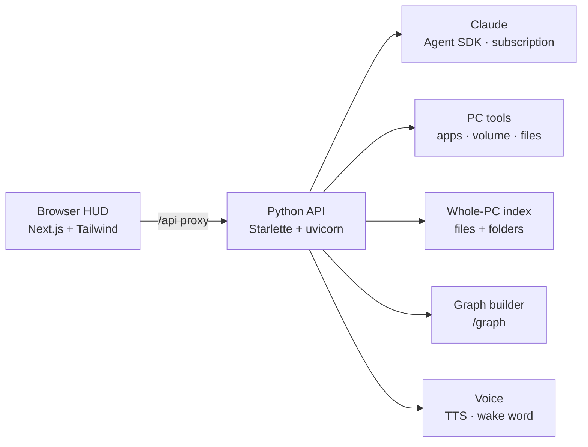

<p align="center">
  
</p>

<p align="center">
  
  
  
  
  
  
</p>

# AXON — AI Assistant + Second Brain

An Iron-Man-style desktop assistant with a sci-fi HUD, powered by **Claude**.
Talk (or type) to it — it **thinks**, **controls your PC**, **reads any file on any
drive**, and renders everything you own as a **living knowledge graph**. Runs on
your **Claude subscription** via a one-time browser login — **no API key, no extra cost.**

---

## ✨ What it does

- 🧠 **Claude brain** — one persistent conversation, restricted to safe tools
- 🖥️ **Controls your PC** — open apps, web search, exact volume %, media, timers &
  reminders, type into any window, screenshots, lock, Spotify, smart-home webhooks
- 🗂️ **Knows your whole PC** — indexes every file & folder across all drives
  (~half a million here); find & open anything, or have it read a file and summarise
- 🕸️ **Second-brain graph** — interactive force-graph of your files: zoom, pan,
  click a node → AXON tells you about it
- 🔊 **Talks back** — offline Windows text-to-speech; **"Hey Axon"** wake word ready
  when a mic is present
- 🔀 **Switch models by voice** — "what models do you have", "switch to opus"
- 🎛️ **Sci-fi HUD** — arc-reactor, live status, top-hub bar-charts, timestamped
  transcript, `LIVE INDEX` counter

## 🧩 Architecture



The browser is the screen; a small local Python agent does the real work (a web
page can't touch your files — by design). They talk over a local `/api` proxy.

## 🚀 Install & run

**The easy way — double-click.** Get AXON, then double-click **`AXON.bat`**.
That's it: on first run it auto-installs everything it needs (Python, Node,
Claude Code, dependencies) and launches; after that it just launches. Then
**sign in** in the browser when prompted. No API key — it uses your Claude
subscription.

**Or one line** (installs to your user folder and launches):
```powershell
irm https://raw.githubusercontent.com/ohkrahul/AXON/main/install.ps1 | iex
```

**Get the files** (if not using the one-liner): download the latest
[**Release ZIP**](https://github.com/ohkrahul/AXON/releases/latest) and unzip, or
`git clone https://github.com/ohkrahul/AXON.git`.

> Windows 10/11 + a Claude subscription (Team/Pro). Everything else is installed for you.
> Advanced/manual setup is in [`SETUP.md`](SETUP.md).

## 🗣️ Try saying / typing

`open notepad` · `set volume to 30%` · `find my resume` · `open the Downloads folder` ·
`what's in my Documents` · `read that config file and summarise it` ·
`set a 5 minute timer` · `play lo-fi on spotify` · `switch to opus` · `clear`

## ⚙️ Configuration — `config.py`

| Setting | Default | Meaning |
|---|---|---|
| `MODEL` | `claude-fable-5` | Model (`AXON_MODEL` to override) |
| `AVAILABLE_MODELS` | fable/opus/sonnet/haiku | Switchable by voice |
| `SPEAK_GREETING` | `True` | Speak the intro on launch |
| `ALLOW_RAW_SHELL` | `False` | `AXON_ALLOW_SHELL=1` gives Claude raw PowerShell |
| `GRAPH_ROOT` | `~` | Folder the graph maps (`AXON_GRAPH_ROOT`) |
| `SMART_HOME_WEBHOOKS` | `{}` | Map actions → webhook URLs |

## 📁 Key files

| File | Role |
|---|---|
| `server.py` | Python API + auth/first-run + all endpoints |
| `web/` | Next.js + Tailwind HUD (the sci-fi UI) |
| `brain.py` | Claude Agent SDK wrapper (runtime model switching) |
| `pc_tools.py` | Curated PC-control + file tools Claude can call |
| `indexer.py` | Whole-PC file/folder catalog + ranked search |
| `graph.py` | Builds the knowledge graph from a folder tree |
| `mouth.py` · `voice_input.py` | Text-to-speech · "Hey Axon" wake word |
| `preflight.py` | Detects Claude login, guides browser sign-in |
| `setup.ps1` · `SETUP.md` | One-shot setup for a new PC |

## 🔒 Notes & limits
- Restricted tools only (`permission_mode="dontAsk"`); raw shell is opt-in.
- Uses your Claude subscription via Claude Code — **you can't** distribute it as a
  public product where strangers use your login (Anthropic terms); that needs the API.
- On locked-down PCs, Whisper STT is blocked by Smart App Control → the OS
  recognizer is used instead.

<p align="center"><sub>Built with Claude · Graphify-Labs</sub></p>
